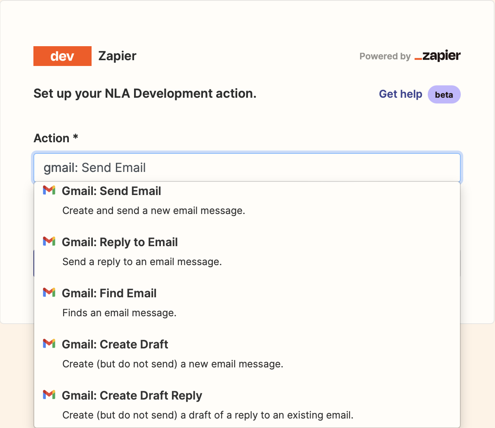
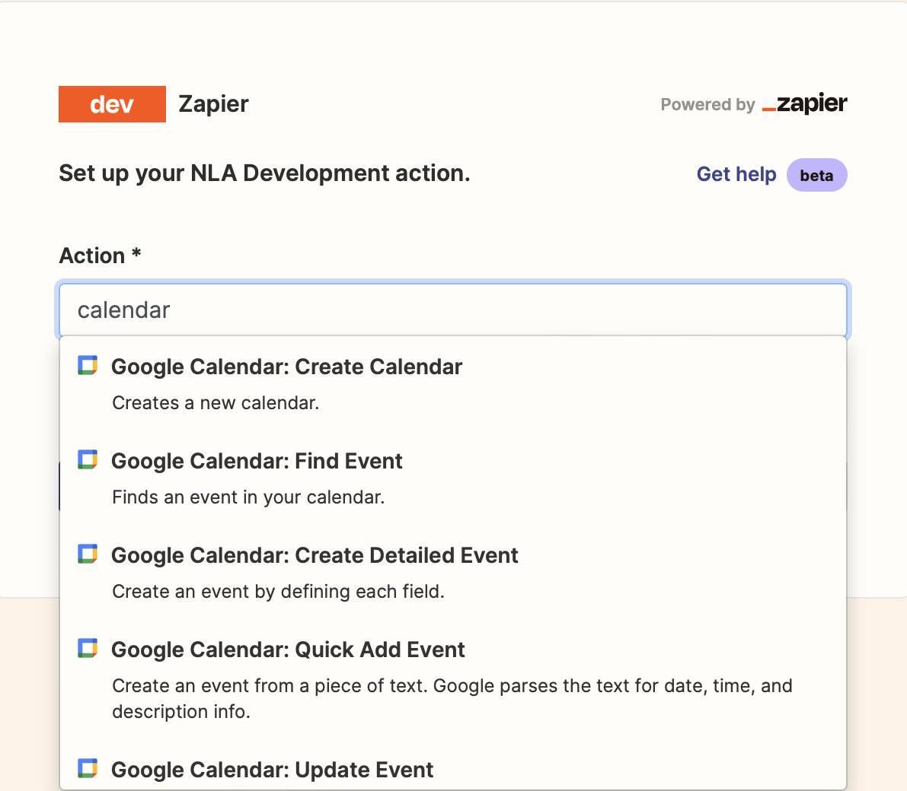
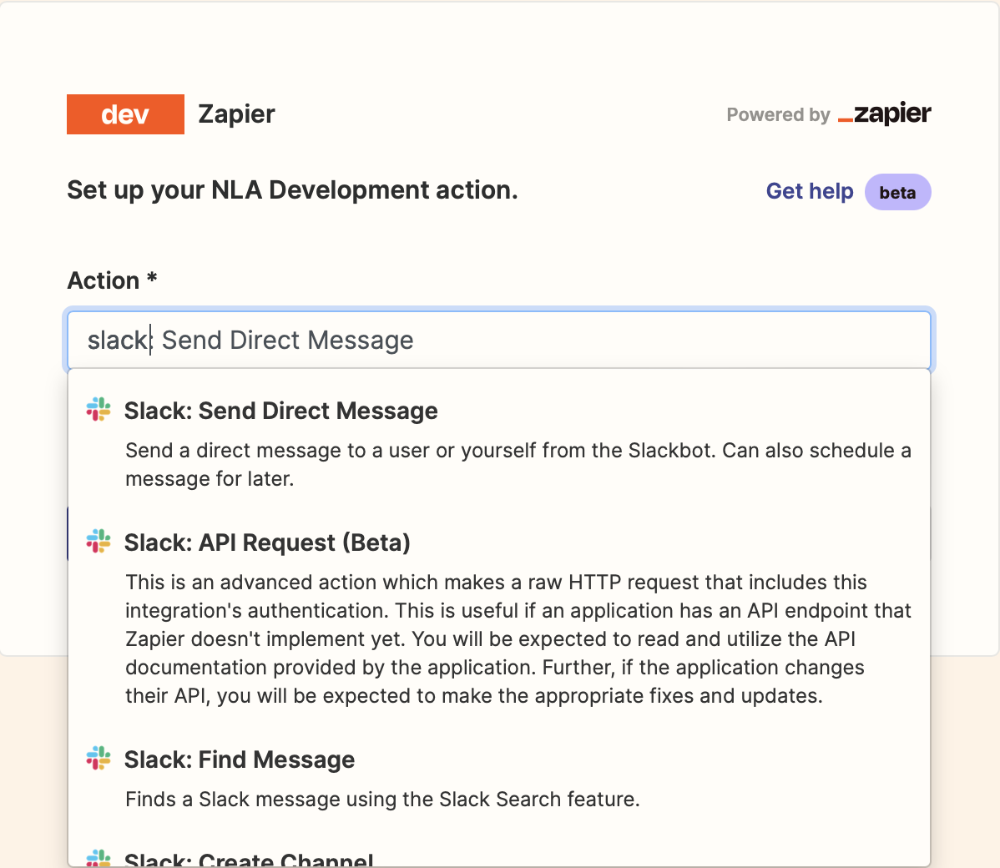
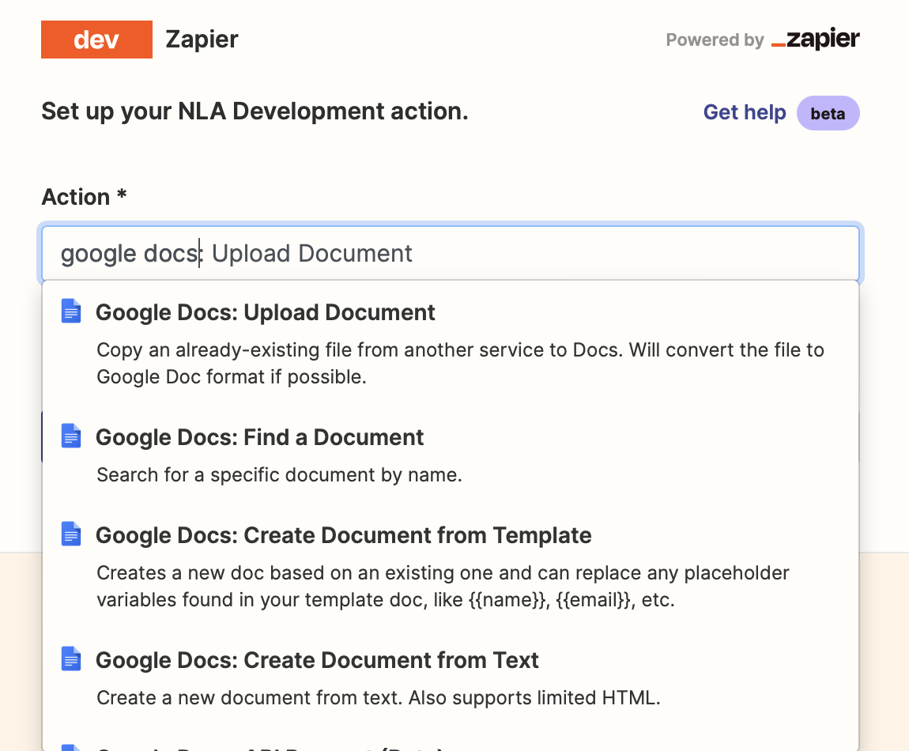

# Your Personal AI Agent 🤖

🚨 **Note**: I made this toolkit for fun and my own personal use. It is not intended for production environments, and there is no warranty whatsoever of any kind. I assume no responsibility or liability for any harm, damage, or inconvenience that may arise from your use of this repository, including but not limited to direct, indirect, incidental, consequential, or any other form of damages. I cannot and will not be held liable for any loss, damage, or harm resulting from any situation related to the repository. Furthermore, this toolkit may contains content generated by Artificial Intelligence (AI). The accuracy, completeness, or usefulness of such content is not guaranteed, and I am not responsible for any consequences resulting from the use or interpretation of AI-generated content. Refer to the License and the Disclaimer on the website for more information

--- 

This repository uses Zapier, Langchain, and OpenAI's ChatGPT to create a personal AI agent for you that can 
- read and create emails, Slack messages, reminders and calendars events
- interact with users and documents
- or any of the other 5000 applications provided through Zapier

In order to use this tool, you need an OpenAI API key, and a Zapier NLA API key:

- **OpenAI**: In order to use ChatGPT capabilities, you need to have an account with OpenAI and have an API key, which you can get from [here](https://openai.com/blog/openai-api). Note that the keys are entered as passwords, and are not saved here. However, if you don't feel comfortable entering your OpenAI API key, I will add other open-source LLM options in the future.
  
- **Zapier**: This toolkit also uses the [Zapier NLA](https://nla.zapier.com/docs/) (Natural Language Actions) API. Once you create a Zapier account, you can set up action settings for the API [here](https://nla.zapier.com/providers/). Your action settings determine what your API key will have access to, such as your email, Slack, and 5000+ other applications made available through Zapier. The portal's sidebar will inform you what you have access to once you input your key. 
        
I recommend adding actions for your daily tools like gmail, calendar, docs, sheets, and Slack to get the most out of your AI assistant!

  
   
  
  

